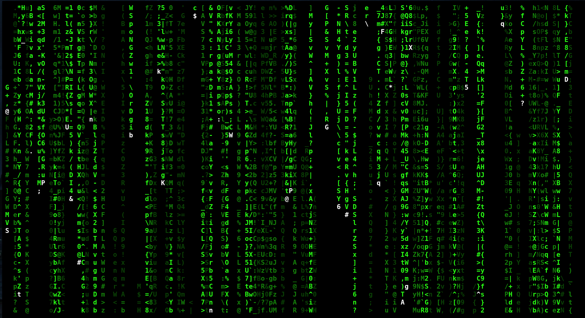

# Matrix Digital Rain



> All I see now is blonde, brunette, redhead.

 -- _Cypher_

# Overview

Pure C implementation of the famous [digital rain](https://en.wikipedia.org/wiki/Matrix_digital_rain) effect from _The Matrix_ series. While the implementation was inspired by [fakesteak](https://github.com/domsson/fakesteak), this implementation uses the default colours of the terminal to match the overall theme of the setup. Colour of the first drop can be changed by changing `ANSI_COL_DROP` which is set to white by default.

Glitching effect is implemented using unicode characters, hence the terminal needs to support them or else change the glitch code characters to ascii before compiling.

# Building

All the code is in a single file (src/main.c) and has no dependencies. So, you can compile it any way you like. If you have autotools installed you can build the project with:
```
autoreconf -i
cd build/
../configure
make
```
# Contributing

Code is hosted on [sourcehut](https://git.sr.ht/~sadeep/matrix-digital-rain). Please submit your patches there or via email to sadeep@asciimx.com ([PGP key](http://www.asciimx.com/sadeep.asc)).
